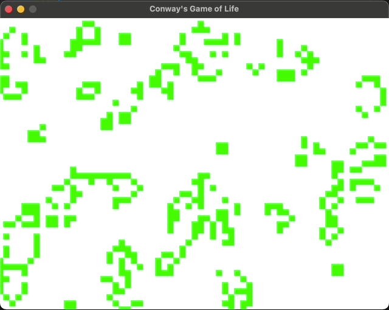

# conways-game-of-life.rs

["Conway's Game of Life"](https://en.wikipedia.org/wiki/Conway%27s_Game_of_Life) written in Rust (by using Bevy).

## Screenshot



## Simple WASM Demo (in Japanese)

[Demo](https://clutte.red/blog/2021/12/wasm-rs/)

## Build / Run

Prerequisite:

- You should have `rustup` installed and have all the necessary tools for Rust development such as `cargo` and `rustc`.

### Run on your computer (Windows/Mac/Linux)

Just

```bash
cargo run
```

### Build for WASM (to run on your browser)

1. Run `rustup target add wasm32-unknown-unknown`
2. Run `cargo install wasm-pack`
3. The following actions are required to work around [an issue](https://github.com/bevyengine/bevy/issues/3099) in Bevy 0.5.0, which should be fixed in the next release of Bevy; Run `cargo update -p tracing-wasm --precise 0.2.0`
4. Run `wasm-pack build --target web --release`
5. `.wasm` files, etc. will be generated under `pkg` directory.
